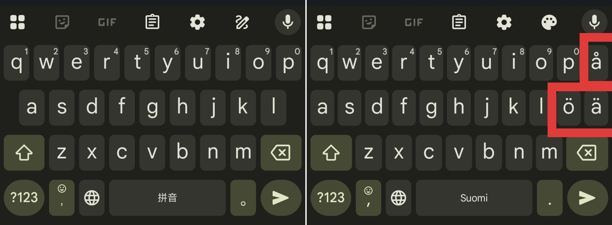
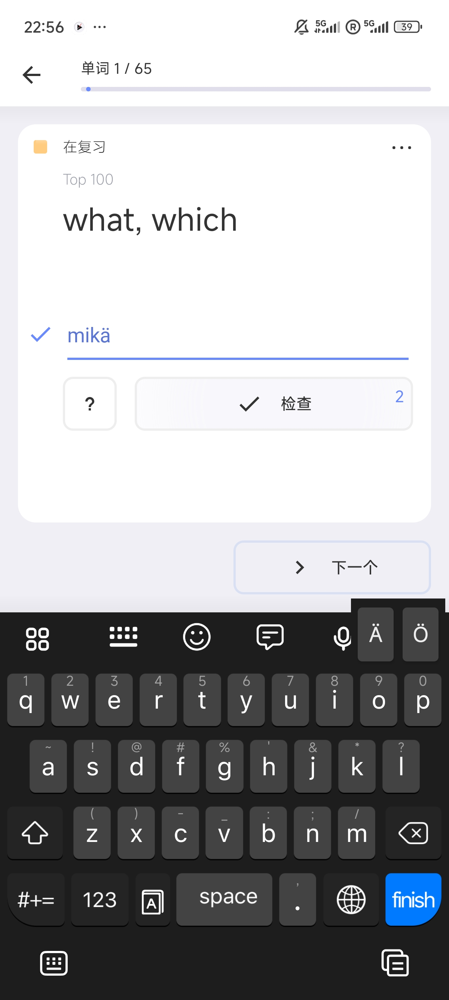

This Android app is for Finnish learners who want to input special letters like ä and ö, which are not included in English keyboards, but at the mean time prefer keeping the "original" keyboard layout.

For me, I type in Mandarin and English in a fast speed, and both Chinese Pinyin and English contain no "extra" letters (so I'm overfitted for the 26 letter a-z keyboard). Even a slight change to the soft keyboard layout lowers my typing speed considerably, which annoys me because I keep making typos(!). I've tried several existing Finnish keyboards and each of them tends to change the layout, for that the "extra" letters need fitting in.

I implemented only basic functions since I know little about Android development :).

- Open the floating buttons
- Hide the floating buttons
- Every time the phone is rebooted, the accessibility service needs opening another time, manually.

Now I can complete my daily dictations with these floating buttons.

Customized floating buttons are interesting features. I can think of many functions they can do. Hope I'll be better at Android development some day. (Google gave me a badge of Android developer the second I downloaded Android Studio...Why...)
